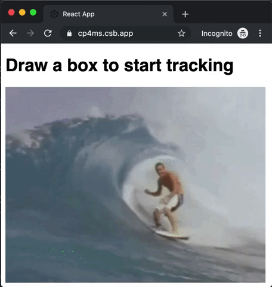

# Object Tracking JavaScript SDK
[](https://npmjs.org/package/@cloud-annotations/object-tracking)
[](https://npmjs.org/package/@cloud-annotations/object-tracking)



[](https://codesandbox.io/s/cranky-keller-cp4ms?fontsize=14&hidenavigation=1&theme=dark)

### Simple object tracking with TensorFlow.js.

Just draw a box and track it as it moves across the video, no training required.

## Installation
```bash
npm install @cloud-annotations/object-tracking
```

## Usage
```js
import objectTracker from '@cloud-annotations/object-tracking'

const frame1 = document.getElementById('img1')
const frame2 = document.getElementById('img2')
const frame3 = document.getElementById('img3')
//    ...
const frameN = document.getElementById('imgN')

const tracker = objectTracker.init(frame1, [x, y, width, height])
const box2 = await tracker.next(frame2)
const box3 = await tracker.next(frame3)
//    ...
const boxN = await tracker.next(frameN)

// box =>
[x, y, width, height]
```

## Usage via Script Tag
```html
<script src="https://cdn.jsdelivr.net/npm/@cloud-annotations/object-tracking"></script>
```
